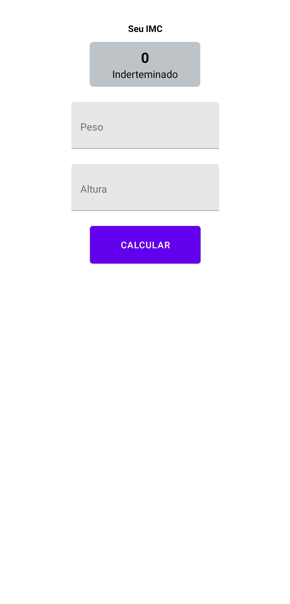
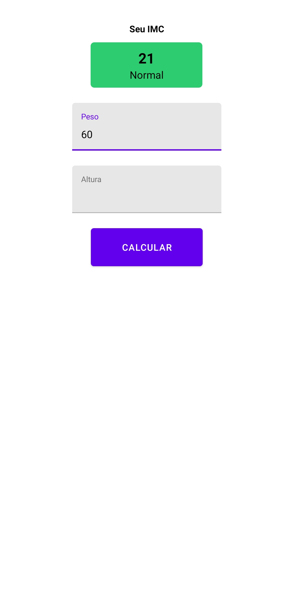

<h1 align="center">
    
</h1>

<h3 align="center">
  Calculadora IMC
</h3>

Aprenda a criar aplicativos com React Native!</blockquote>

  
  
  

## :rocket: Sobre o Aplicativo

Este aplicativo foi desenvolvido a partir do primeiro contato com React Native, apenas para fins de aprendizado!

### Como testar

=>$ yarn

=>$ expo start

=>Baixar o Expo App e escaner o QR Code

### Considerações Finais

Muito satisfeito em aprender uma nova tecnologia!

